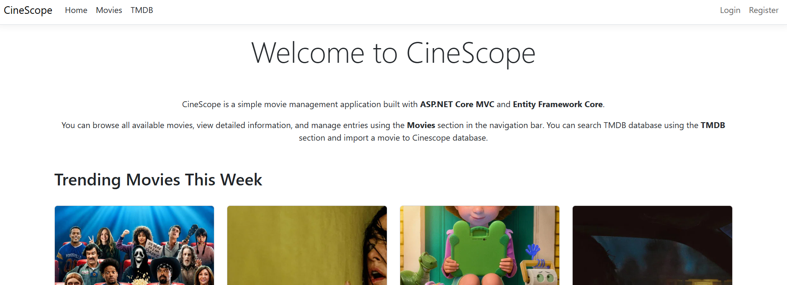
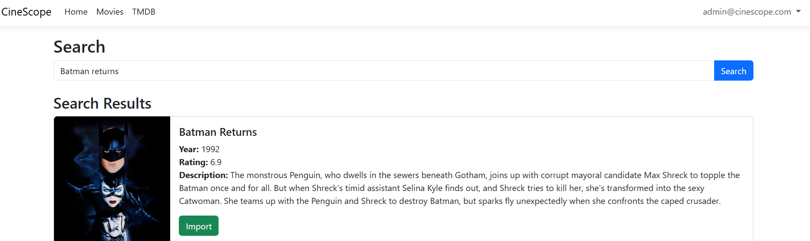
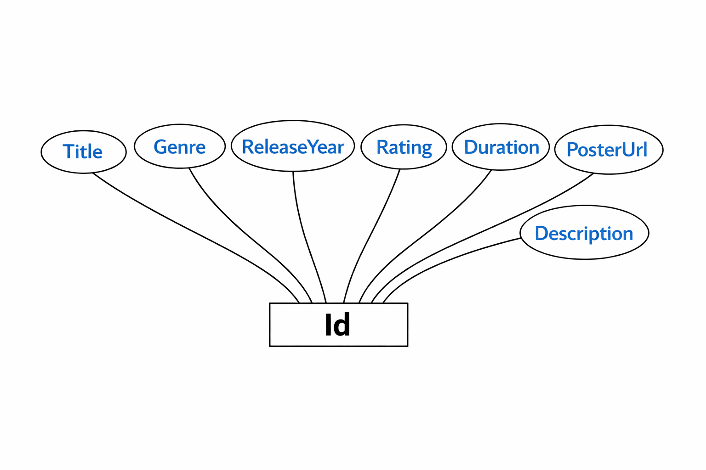

# CineScope level 1,3 and 5 with some bootstrap styling and responsiveness, and Azure deployment

CineScope is a movie catalog web application for browsing, managing, and importing movie data with TMDB integration. Logged in users can mark favorites. Admin have full control over imports and movie operations.

## Table of Contents

- [Features](#features)
- [Tech stack](#tech-stack)
- [Screenshots](#screenshots)
- [Architecture Diagram](#architecture-diagram)
- [ER Diagram](#er-diagram)
- [How to use](#how-to-use)
- [Local setup](#local-setup)
- [Azure deployment](#azure-deployment)
- [Reflection Report](#reflection-report)
- [Credits](#credits)

## Features

- CRUD operations on movies
  - Add Movie
  - Edit Movie
  - Delete Movie
  - View Details
- Search by title
- Integrates TMDB API:
  - Auto-fetch posters
  - Import movie metadata
  - Trending movies
  - Search external database, with pagination
- Authentication & Roles

  The home page displays trending movies from TMDB, while the Movies section uses the local SQL Server database managed through Entity Framework Core. The TMDB tab is used to search for and import movie data from TMDB.

## Tech stack

- Backend: ASP.NET Core 9/10 MVC
- Database: SQL Server + Entity Framework Core
- Frontend: Razor Views + Bootstrap 5
- API Integration: TMDB API
- Deployment: Azure App Service
  https://cinescope20260528193817-czd6a8bda4arazav.swedencentral-01.azurewebsites.net

## Screenshots

## Architecture Diagram

## ER Diagram

## API architecture and roles

CineScope uses a layered API architecture.
All external data comes from TMDB through a dedicated IMovieClient service, which handles HTTP calls and maps external DTOs into the internal Movie model.
Inside the app, the MVC controllers act as the internal API: public GET endpoints for browsing, authenticated POST endpoints for favorites, and admin‑protected endpoints for CRUD. EF Core forms the data API, with MyDbContext mediating all access to SQL Server. Finally, Identity wraps everything with authentication for members and a single explicit Admin role for protected operations.

## How to use

First you can see the Trending movies (this week), on the Home page.

You can browse all available movies, view detailed information, and manage entries using the Movies section in the navigation bar. You can search TMDB database using the TMDB section and import a movie to Cinescope database.

## Local setup

1. Clone or download the repository.
2. Open the solution in Visual Studio 2026 or later.
3. Configure the connection string in `appsettings.json` so it points to your local SQL Server instance.
4. Add your TMDB API settings, "TMDB:ApiKey", in `appsettings.json` or user secrets/environment variable, depending on how you want to store sensitive values.
5. Restore NuGet packages.
6. Update the database so the `Movies` table and seed data are created.
7. Run the application.

## Azure deployment

For Azure deployment, the application can be published directly from Visual Studio to an Azure App Service. The main deployment requirements are:

- A valid Azure App Service target
- A production SQL Server connection string configured in Azure
- TMDB API configuration provided through Azure App Service application settings
- Database migrations applied to the production database

This setup allows the same ASP.NET Core MVC application to run in the cloud with SQL Server as the persistent data store and TMDB as the external movie data provider.

## Reflection Report

The decision to make level 1,3 and level 5 of the assignment was grounded on the learning involved. This way most knowledge was gathered, that hadn't been done to some degree before, and involved:

MVC structure, Controllers, Views, Models, EF Core and how to integrate an external API like TMDB and do pagination properly. Furthermore I learned Authentication & Roles through Identity in .NET 10. I also learned how to deploy an ASP.NET Core application to Azure App Service, which was a new experience for me. The project also provided a good opportunity to practice database design and management using SQL Express and SQL Server extensions for Visual Studio. Furthermore, I learned how to set up and manage Azure Managed Identity and other application settings, including sensitive information like API keys which uses environment variables. Overall, the project was a comprehensive learning experience that covered a wide range of topics in web development with ASP.NET Core.

## Credits

- Project idea: Lexicon Syd
- Developer: Johan
